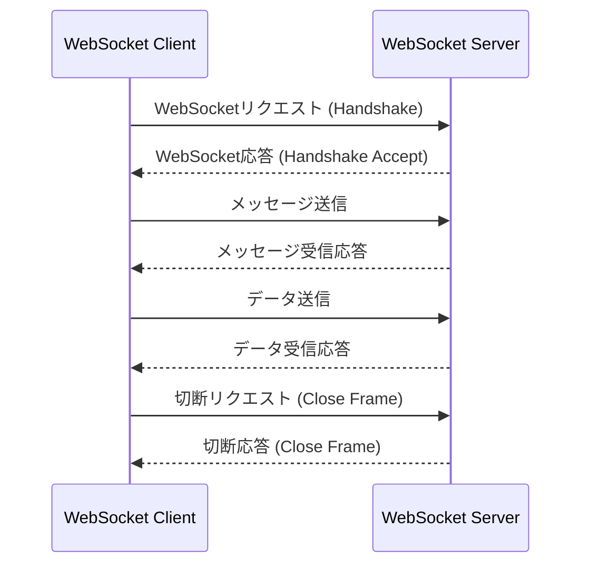

```mermaid
    sequenceDiagram
        participant Client as WebSocket Client
        participant Server as WebSocket Server

        Client->>Server: WebSocketリクエスト (Handshake)
        Server-->>Client: WebSocket応答 (Handshake Accept)
        Client->>Server: メッセージ送信
        Server-->>Client: メッセージ受信応答
        Client->>Server: データ送信
        Server-->>Client: データ受信応答
        Client->>Server: 切断リクエスト (Close Frame)
        Server-->>Client: 切断応答 (Close Frame)
```

recommendlistに遷移した時に
