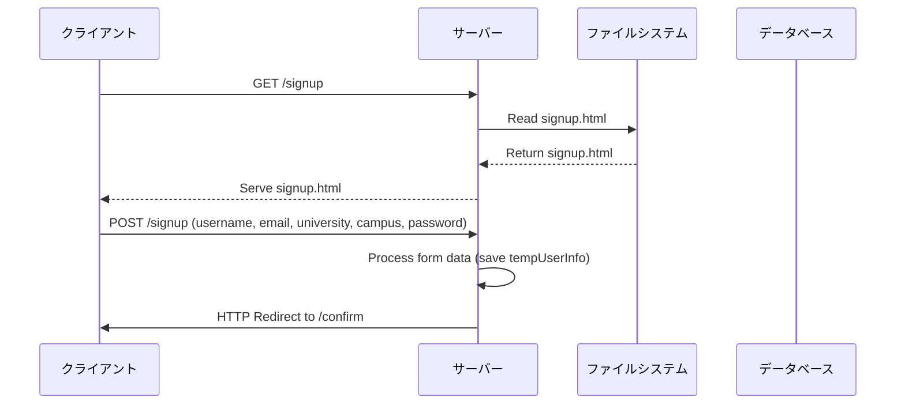
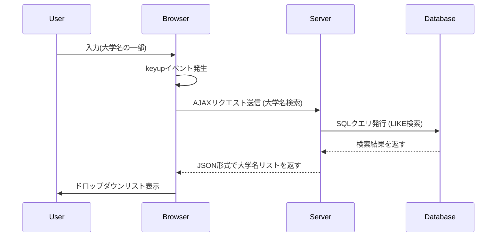
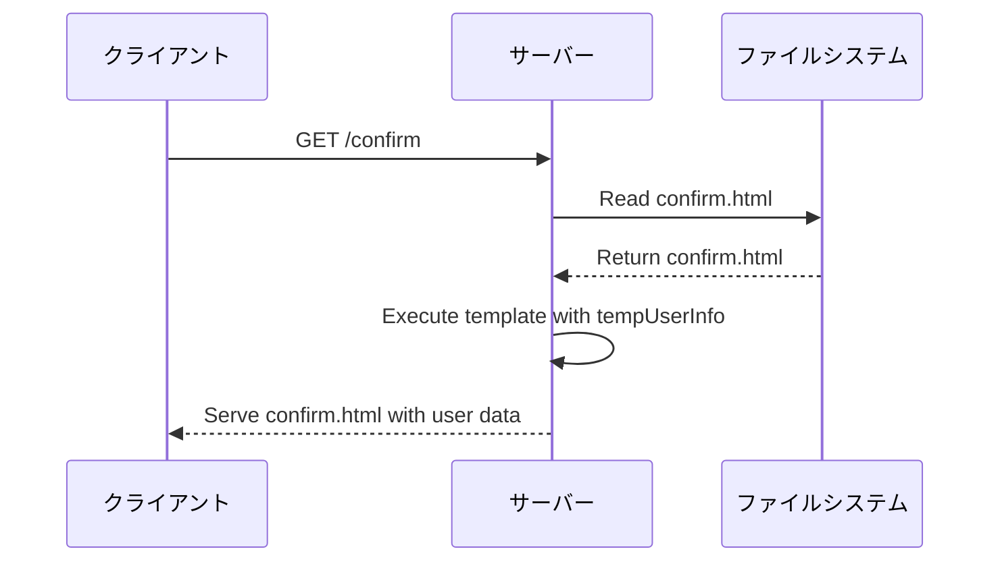
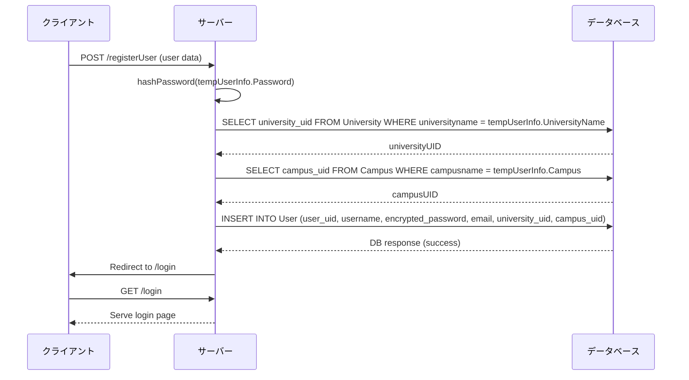
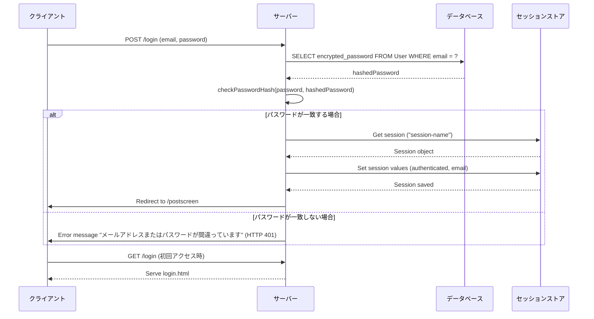
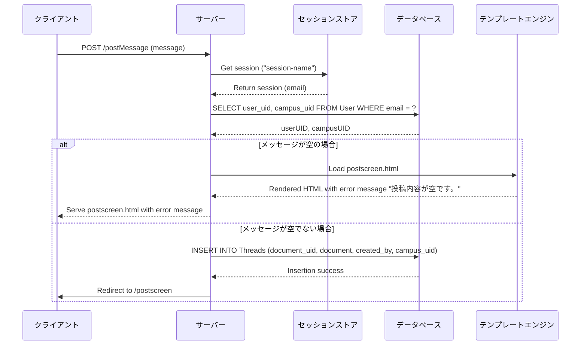
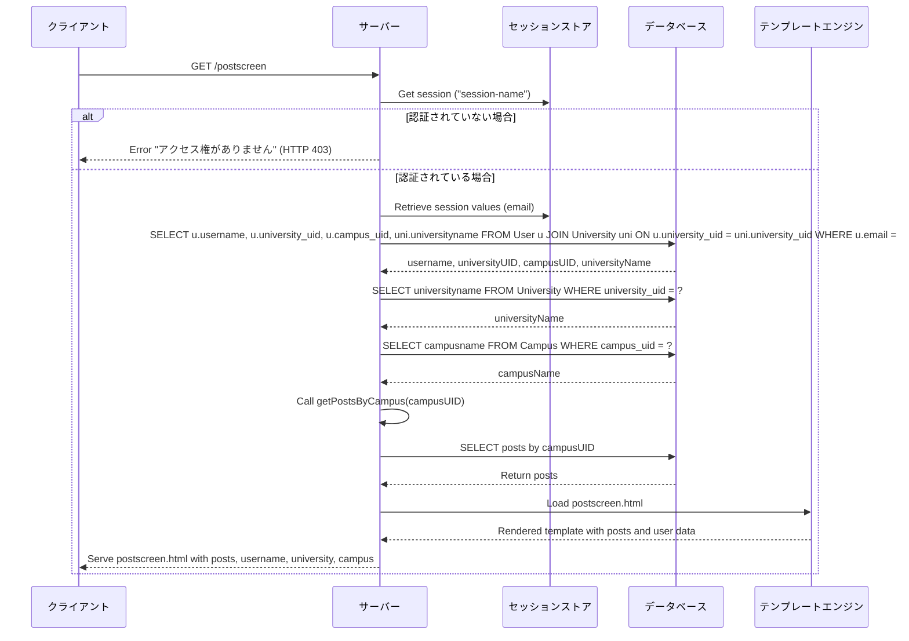

SignUp

```mermaid
    sequenceDiagram
        participant Client as クライアント
        participant Server as サーバー
        participant FileSystem as ファイルシステム
        participant DB as データベース
        
        Client->>Server: GET /signup
        Server->>FileSystem: Read signup.html
        FileSystem-->>Server: Return signup.html
        Server-->>Client: Serve signup.html

        Client->>Server: POST /signup (username, email, university, campus, password)
        Server->>Server: Process form data (save tempUserInfo)
        Server->>Client: HTTP Redirect to /confirm
```
---
オートフィル機能　

```mermaid
    sequenceDiagram
    participant User
    participant Browser
    participant Server
    participant Database

    User->>Browser: 入力(大学名の一部)
    Browser->>Browser: keyupイベント発生
    Browser->>Server: AJAXリクエスト送信 (大学名検索)
    Server->>Database: SQLクエリ発行 (LIKE検索)
    Database-->>Server: 検索結果を返す
    Server-->>Browser: JSON形式で大学名リストを返す
    Browser->>User: ドロップダウンリスト表示

```

---

Confirm

```mermaid
    sequenceDiagram
        participant Client as クライアント
        participant Server as サーバー
        participant FileSystem as ファイルシステム
        
        Client->>Server: GET /confirm
        Server->>FileSystem: Read confirm.html
        FileSystem-->>Server: Return confirm.html
        Server->>Server: Execute template with tempUserInfo
        Server-->>Client: Serve confirm.html with user data

```
---

Register

```mermaid
sequenceDiagram
    participant Client as クライアント
    participant Server as サーバー
    participant DB as データベース

    Client->>Server: POST /registerUser (user data)
    Server->>Server: hashPassword(tempUserInfo.Password)
    Server->>DB: SELECT university_uid FROM University WHERE universityname = tempUserInfo.UniversityName
    DB-->>Server: universityUID
    Server->>DB: SELECT campus_uid FROM Campus WHERE campusname = tempUserInfo.Campus
    DB-->>Server: campusUID
    Server->>DB: INSERT INTO User (user_uid, username, encrypted_password, email, university_uid, campus_uid)
    DB-->>Server: DB response (success)
    Server->>Client: Redirect to /login
    Client->>Server: GET /login
    Server-->>Client: Serve login page
```
---

Login

```mermaid
    sequenceDiagram
    participant Client as クライアント
    participant Server as サーバー
    participant DB as データベース
    participant Session as セッションストア

    Client->>Server: POST /login (email, password)
    Server->>DB: SELECT encrypted_password FROM User WHERE email = ?
    DB-->>Server: hashedPassword
    Server->>Server: checkPasswordHash(password, hashedPassword)
    alt パスワードが一致する場合
        Server->>Session: Get session ("session-name")
        Session-->>Server: Session object
        Server->>Session: Set session values (authenticated, email)
        Session-->>Server: Session saved
        Server->>Client: Redirect to /postscreen
    else パスワードが一致しない場合
        Server->>Client: Error message "メールアドレスまたはパスワードが間違っています" (HTTP 401)
    end
    Client->>Server: GET /login (初回アクセス時)
    Server-->>Client: Serve login.html
```
---

メッセージを保存

```mermaid
    sequenceDiagram
    participant Client as クライアント
    participant Server as サーバー
    participant Session as セッションストア
    participant DB as データベース
    participant Template as テンプレートエンジン

    Client->>Server: POST /postMessage (message)
    Server->>Session: Get session ("session-name")
    Session-->>Server: Return session (email)
    Server->>DB: SELECT user_uid, campus_uid FROM User WHERE email = ?
    DB-->>Server: userUID, campusUID

    alt メッセージが空の場合
        Server->>Template: Load postscreen.html
        Template-->>Server: Rendered HTML with error message "投稿内容が空です。"
        Server-->>Client: Serve postscreen.html with error message
    else メッセージが空でない場合
        Server->>DB: INSERT INTO Threads (document_uid, document, created_by, campus_uid)
        DB-->>Server: Insertion success
        Server->>Client: Redirect to /postscreen
    end
```
---
メッセージを表示　

```mermaid
    sequenceDiagram
    participant Client as クライアント
    participant Server as サーバー
    participant Session as セッションストア
    participant DB as データベース
    participant Template as テンプレートエンジン

    Client->>Server: GET /postscreen
    Server->>Session: Get session ("session-name")
    alt 認証されていない場合
        Server-->>Client: Error "アクセス権がありません" (HTTP 403)
    else 認証されている場合
        Server->>Session: Retrieve session values (email)
        Server->>DB: SELECT u.username, u.university_uid, u.campus_uid, uni.universityname FROM User u JOIN University uni ON u.university_uid = uni.university_uid WHERE u.email = ?
        DB-->>Server: username, universityUID, campusUID, universityName

        Server->>DB: SELECT universityname FROM University WHERE university_uid = ?
        DB-->>Server: universityName

        Server->>DB: SELECT campusname FROM Campus WHERE campus_uid = ?
        DB-->>Server: campusName

        Server->>Server: Call getPostsByCampus(campusUID)
        Server->>DB: SELECT posts by campusUID
        DB-->>Server: Return posts

        Server->>Template: Load postscreen.html
        Template-->>Server: Rendered template with posts and user data
        Server-->>Client: Serve postscreen.html with posts, username, university, campus
    end
```

